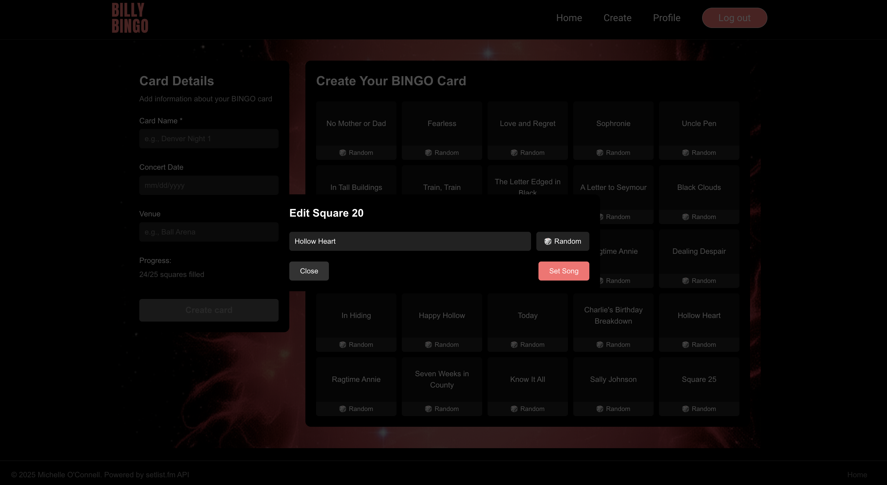

# Billy BINGO: Front End

_A dynamic React-based interface bringing the Billy Strings Concert BINGO fan experience to life._

---

# Table of Contents

- [Live Project](#live-project)
- [Introduction](#introduction)
- [Project Goals](#project-goals)
- [What Was Done](#what-was-done)
- [Features](#features)
- [Technologies](#technologies)
- [Screenshots](#screenshots)
- [Conclusion](#conclusion)
- [Future Improvements](#future-improvements)
- [Deployment & Requirements](#deployment--requirements)
- [Configuration](#configuration)

---

## Live Project

**Domain:** [app.billybingo.moonangel.com](https://app.billybingo.moonangel.com/)  
**Back-End Repository:** [Billy BINGO Back-End](https://github.com/michelleoco/billy_bingo_express)

---

## Introduction

**Billy BINGO** is a fan-driven digital platform inspired by the improvisational live concerts of bluegrass musician Billy Strings. Since every concert features a unique setlist, fans (“Goats”) create personalized BINGO cards predicting which songs will be played.

This front-end repository contains the **React.js** application that powers the interactive user experience. It allows fans to sign up, create and customize their BINGO cards, (COMING SOON: track song plays in real-time, and view their past game history) — all through a responsive, mobile-friendly interface that connects to the Billy BINGO API.

---

## Project Goals

- Develop a responsive and interactive user interface for the Billy BINGO web app.
- Enable user authentication and profile management via API integration.
- Provide interactive BINGO card creation, customization, and preview.
- Connect to the back-end API for song data, card history, and recommendations.
- Ensure an accessible, mobile-optimized, and engaging fan experience.

---

## What Was Done

The front end was built using **React** and **Vite**, with key implementations including:

1. **User Interface & Authentication**

   - Signup/signin with form validation.
   - Modal-based authentication workflows.
   - Persistent login via local storage of JWT tokens.

2. **BINGO Card Functionality**

   - Dynamic generation and display of BINGO cards.
   - Customizable song selection from historical data or manual entry.

3. **Profile Management**

   - View and edit user preferences.
   - Display past cards and win history.

4. **Responsive & Accessible Design**

   - Mobile-first approach with adaptive layouts.
   - Keyboard navigable and screen-reader friendly.

5. **Error Handling & Feedback**
   - Inline form validation and error messages.
   - User notifications for important events (e.g., BINGO achieved).

---

## Features

- User authentication (signup/signin)
- Interactive BINGO card creation and play
- Song recommendation integration from back-end API
- User profile and history management
- Responsive mobile-first design
- Error handling and real-time feedback

---

## Technologies

- **React** – Front-end framework
- **React Router DOM** – Client-side routing
- **Vite** – Build tool and development server
- **JavaScript (ES6+)** – Core programming language
- **CSS3** – Styling and responsive design
- **HTML5** – Markup structure
- **ESLint** – Code style enforcement
- **Context API** - State management

---

## Screenshots

**Homepage**  


**BINGO Card Builder**  


**BINGO Square edit**  


---

## Conclusion

The Billy BINGO front end transforms setlist predictions into an exciting, interactive game for fans — offering a seamless, responsive interface that makes playing BINGO during live shows intuitive and fun.

## Future Improvements

- **Real-Time Play:** Sync played songs automatically with live setlists.
- **Social Sharing:** Allow users to post their winning cards to social media.
- **Offline Mode:** Save card data locally in case of poor venue connectivity.
- **Animations:** Add engaging transitions for card interactions.

## Deployment & Requirements

**Requirements:**

- Node.js ≥ 18
- npm ≥ 9.0

**Installation:**

```bash
git clone https://github.com/michelleoco/billy_bingo_react.git
cd billy_bingo_react
npm install

# For development
npm run dev

# For production build
npm run build
```

## Configuration

The app connects to the Billy Bingo API:

- **Development:** http://localhost:3001/api
- **Production:** https://api.billybingo.moonangel.com/api

No additional configuration required for basic usage.
